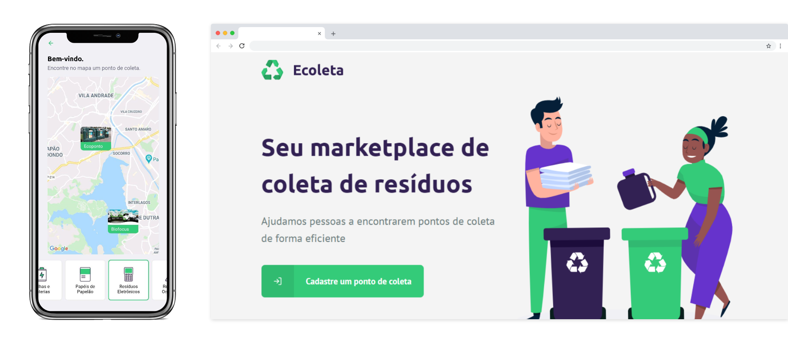

<h1 align="center">
    ♻️ Ecoleta
</h1>

<p align="center">
  
   
</p>
<p align="center">
  <a href="#bookmark-sobre">Sobre</a>&nbsp;&nbsp;&nbsp;|&nbsp;&nbsp;&nbsp;
  <a href="#rocket-tecnologias">Tecnologias</a>&nbsp;&nbsp;&nbsp;|&nbsp;&nbsp;&nbsp;
  <a href="#%EF%B8%8F-configuração">Configuração do projeto</a>&nbsp;&nbsp;&nbsp;|&nbsp;&nbsp;&nbsp;
  <a href="#memo-licença">Licença</a>
</p>

<p align="center">
  
<p>

## :bookmark: Sobre

O **Ecoleta** é uma aplicação Web desenvolvida pensando na Semana Mundial do Meio Ambiente. Com o Ecoleta você pode cadastrar pontos de coleta de itens, como lâmpadas, papel e papelão, resíduos orgânicos, entre outros.
  
Este projeto foi idealizado e desenvolvido pela [Rocketseat](https://rocketseat.com.br/).

## :rocket: Tecnologias

- [TypeScript](https://www.typescriptlang.org/)
- [React](https://reactjs.org/)
- [Expo](https://expo.io/)
- [Node](https://nodejs.org/en/)
- [Express](https://expressjs.com/)
- [SQLite3](https://www.sqlite.org/index.html)
- [Knex](http://knexjs.org/)
- [SQLite3](https://www.npmjs.com/package/sqlite3)

## ⚙️ Configuração

- ### Server (Back-end)

  ```bash
  # Abra um terminal e copie este repositório com o comando
  $ git clone https://github.com/alexandrecorazza/ecoleta.git
  # ou use a opção de download.

  # Entre na pasta server 
  $ cd ecoleta/server

  # Instale as dependências
  $ yarn install

  #Crie as tabelas do banco de dados
  $ knex:migrate

  #Insira os itens de coleta, na tabela itens
  $ knex:seed

  # Rode o servidor
  $ yarn dev
  ```

<br>

- ### Web (Front-end)

  ```bash
  # Entre na pasta web com 
  $ cd ecoleta/web

  # Instale as dependências
  $ yarn install

  # Rode o aplicação
  $ yarn start
  ```

## :memo: Licença

Esse projeto está sob a licença MIT. Veja o arquivo [LICENSE](LICENSE.md) para mais detalhes.
